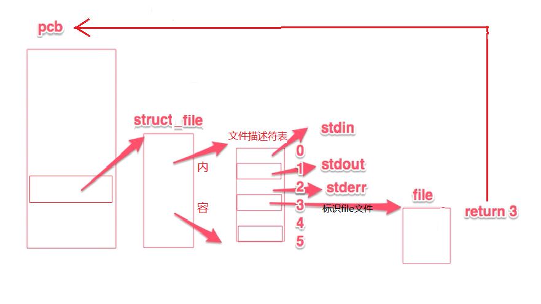
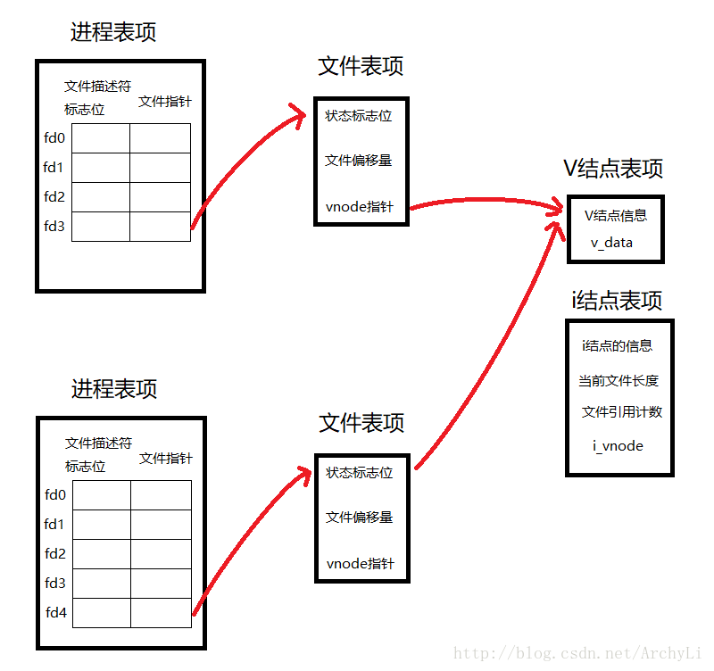
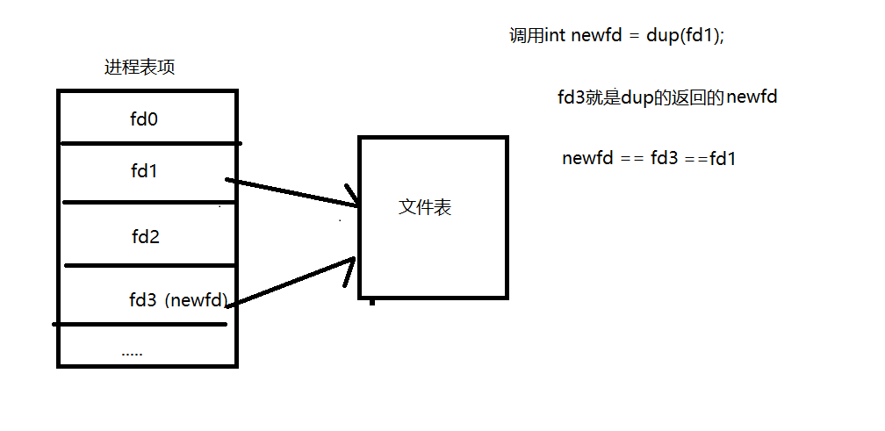
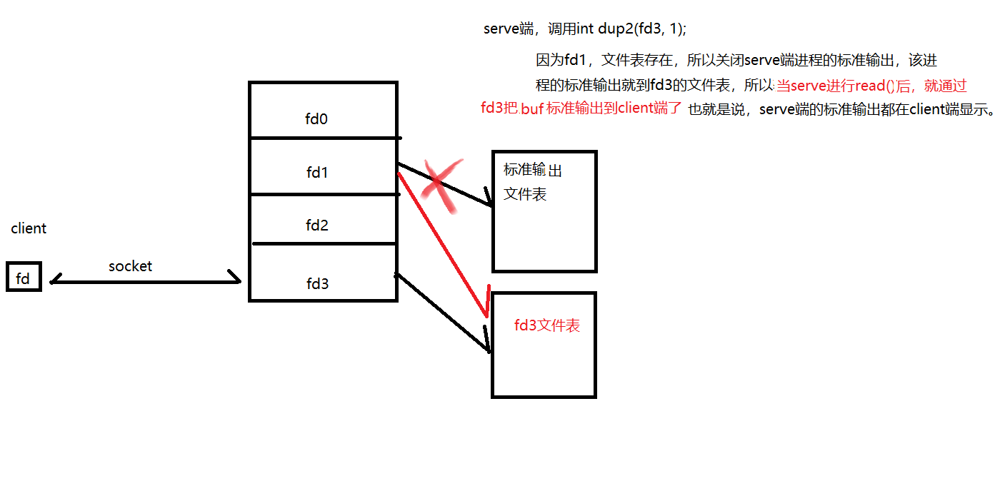

---


layout: post
title:  linux中dup/dup2详解
date:   2019/9/30
categories: linux

tags: linux
---

* content
{:toc}
- 



上面两张图就是介绍一下：

每个进程有一个进程表项，每个文件描述符就是当成文件指针啦，对应有个文件表项，说简单点，就是每个文件指针指向一个文件，这里就不多说了，详细了解：<https://blog.csdn.net/lk07828/article/details/52813372>

下面开始进入主题了

## dup

```
#include <unistd.h>
int dup(int oldfd);

返回值：
当复制成功是，返回最小的尚未被使用过的文件描述符，若有错误则返回-1
```

- 其实我理解的dup就是复制oldfd这个描述符，而这个返回的新的描述符和oldfd指向同一个文件表项，然后他们就可以一起共享这个表啦，就这么简单，下面我画了张图，看图简单点

  


## dup2

```
#include <unistd.h>
int dup2(int oldfd, int newfd);

返回值： 
若dup2调用成功则返回新的文件描述符，出错则返回-1. 
```

dup2与dup区别是dup2可以用参数newfd指定新文件描述符的数值。若参数newfd已经被程序使用，则系统就会将newfd所指的文件关闭，若newfd等于oldfd，则返回newfd,而不关闭newfd所指的文件。 这是复制的，简化了一点，哈哈，接下来来个有意思的，看图

建立socket连接后，把server端stdout重定向到fd3，代码就不贴了，就是在基础sockettcp通信的read()前加了一行代码

- 如果理解并且对icmp协议了解，可以尝试写个icmp后门程序：

  思路：

  1.发出icmp包(包含 秘钥 ，myip，myport，对端ip)

  2.对端收到icmp包，通过秘钥，知道是对端是后门程序，通过ip和port绑定连接,得到fd

  3.dup2(fd,0),dup2(fd,1),dup2(fd,2)	重定向标准输入，输出，error

  4.fork父进程exit，子进程-------->execl("/bin/sh", "/bin/sh", (char *)0);	//这样就能操作对方shell啦


这是我第一篇自己写的blog，希望对大家有帮助，有不对的能提出，非常感谢！！！

